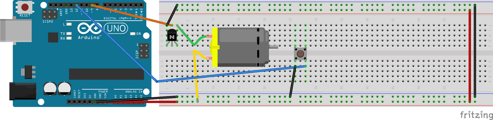
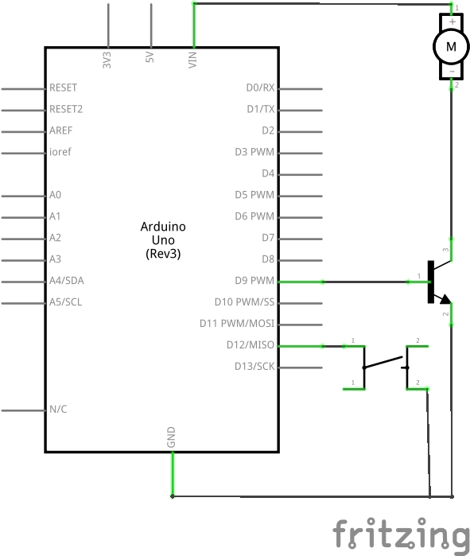

# Sketch 1: DC Motor + Push Button

**[process.patrickjam.es/](https://process.patrickjam.es/2020/10/08/weeks-5-6-motors-servos-and-transistors/)**

```c++
void setup() {  
  pinMode(9, OUTPUT);
  pinMode(12, INPUT_PULLUP);
}

bool motorOn = false;

void loop() {
  if(digitalRead(12) == 0) {
    motorOn = !motorOn;
    delay(500);
  }

  if (motorOn) {
      analogWrite(9, 255);
  } else {
      analogWrite(9, 0);
  }
}
```



