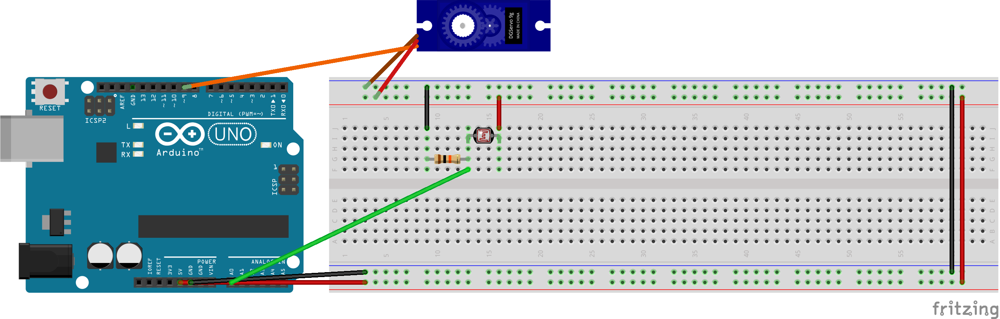
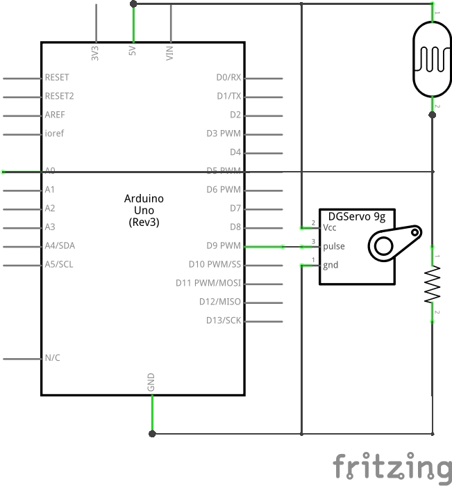

# Sketch 2: Servo + Photocell

**[process.patrickjam.es/](https://process.patrickjam.es/2020/10/08/weeks-5-6-motors-servos-and-transistors/)**

```c++
#include <Servo.h>
Servo myservo;

void setup() {
  myservo.attach(9);
}

void loop() {
  float pos = map(analogRead(0), 0, 1023, 0, 180);
  myservo.write(pos);
}
```



